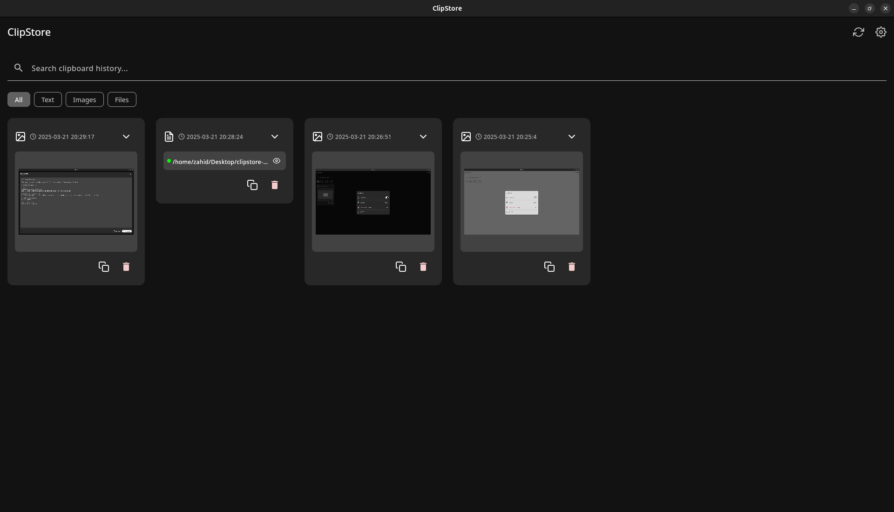
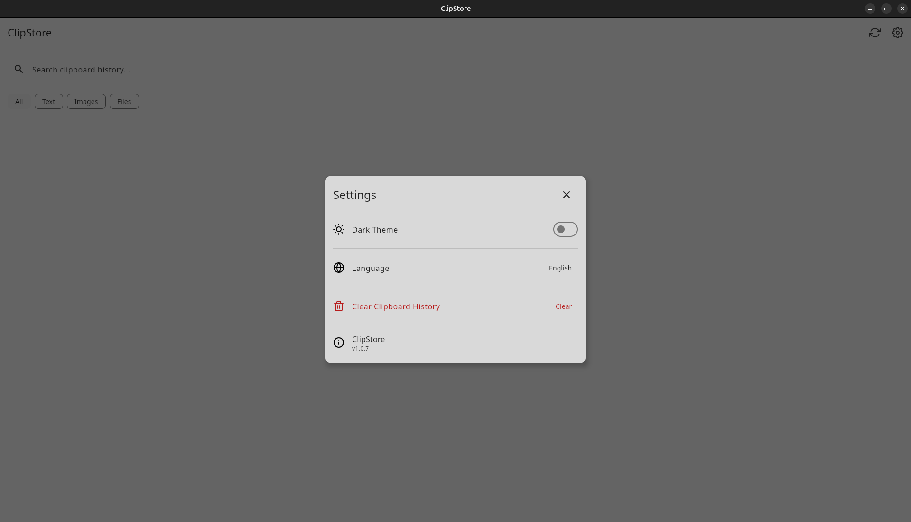
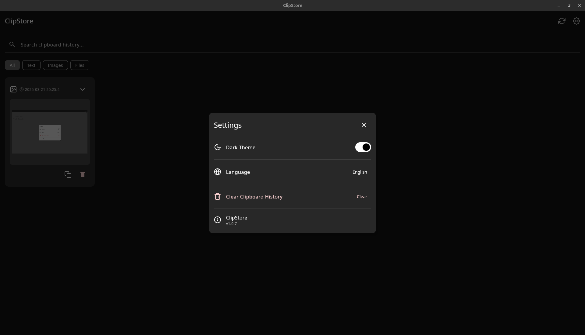
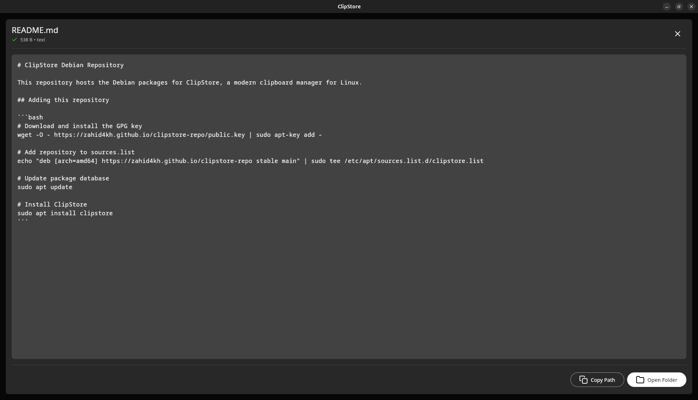

# ClipStore

ClipStore is a modern, feature-rich clipboard manager for desktop built with Kotlin and Compose UI. It allows you to effortlessly track, manage, and reuse your clipboard history.



## ✨ Features

- **📋 Comprehensive Clipboard History** - Automatically tracks text, rich text(coming soon!!!), images, and file references
- **🔍 Powerful Search & Filter** - Quickly find past clipboard items
- **✏️ Edit Content** - Modify text items before reusing them
- **📂 File Support** - Preview and manage file references directly from the interface
- **🔄 Multi-Selection** - Perform bulk delete on multiple clipboard items
- **🌓 Dark & Light Themes** - Choose your preferred visual experience
- **🌐 Multilingual** (coming soon!!!) - Supports English, Spanish, French, and German

## 📸 Screenshots

<div align="center">
  
  
</div>

<div align="center">
  
</div>

## 🛠️ Tech Stack

- **Kotlin** - Primary programming language
- **Compose Multiplatform** - UI toolkit
- **Kotlinx.coroutines** - Asynchronous programming
- **Kotlinx.serialization** - JSON serialization/deserialization
- **Java AWT** - System clipboard integration

## 💻 Setup & Installation

### Option 1: Debian Package (Recommended)

1. Download the latest .deb package from the [GitHub Releases](https://github.com/zahid4kh/clipstore-repo/releases) page

2. Install the package using apt:
   
   ```bash
   sudo apt install ./clipstore_x.x.x.deb
   ```

3. Alternatively, you can use the dpkg command:
   
   ```bash
   sudo dpkg -i clipstore_x.x.x.deb
   sudo apt-get install -f  # Installs any missing dependencies
   ```

4. Launch ClipStore from your application menu or using the command:
   
   ```bash
   clipstore
   ```

## 🚀 Usage

### Basic Usage

1. The application automatically starts monitoring your clipboard after launch
2. Recently copied items appear at the top of the list
3. Click on an item to select it or expand it for more details
4. Use the search bar to find specific items
5. Filter items by type using the filter chips

### Managing Items

- Click the copy icon to copy an item back to the system clipboard
- Use the edit button to modify text content
- Select multiple items to perform bulk operations
- Delete button removes items from history


## 📄 License

This project is licensed under the MIT License - see the LICENSE file for details.

## 🙏 Acknowledgements

- [Feather Icons](https://feathericons.com/) for the beautiful iconography
- [Material Design 3](https://m3.material.io/) for design inspiration
